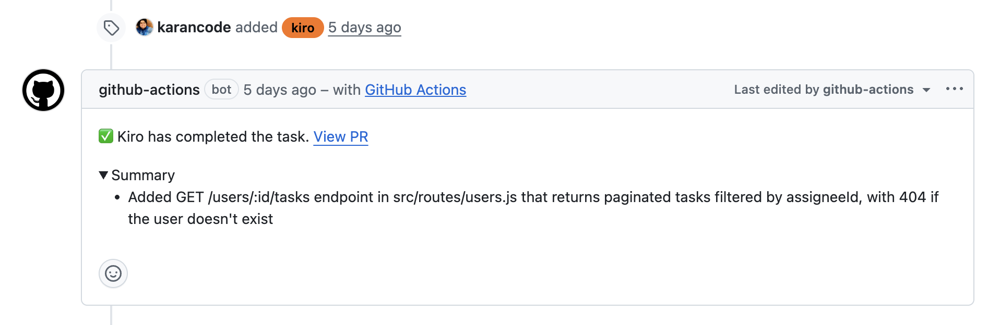

# kiro-action



[](https://github.com/marketplace/actions/kiro-action)
[](https://github.com/kirodotdev-labs/kiro-action/releases)
[](LICENSE)
[](https://github.com/kirodotdev-labs/kiro-action/actions/workflows/ci.yml)

A GitHub Action that runs [Kiro](https://kiro.dev) — AWS's agentic IDE and command-line interface — on your pull requests, issues, and schedules. Mention `/kiro` in a comment, label an issue with `kiro`, or run it from a workflow with an explicit prompt. Kiro reads the context, writes the code, and opens a pull request.

It's [headless mode](https://kiro.dev/docs/cli/headless), wired up to GitHub.

## What you can do with it

- **Comment on a PR or issue** — `/kiro fix the null deref in src/auth/login.ts` and Kiro pushes a fix
- **Label an issue with `kiro`** — Kiro reads the body, implements it, opens a PR. No bot user needed.
- **Run on a schedule** — weekly dependency upgrades, drift checks, doc sync, whatever you wire up
- **Wrap it in a custom prompt** — security review on every PR, auto-fix CI failures, triage new issues

The [`examples/`](examples/) directory has nine ready-to-drop-in workflows.

## Quickstart

**1.** Add `KIRO_API_KEY` as a repo secret (Settings → Secrets and variables → Actions).

**2.** Drop a workflow file into `.github/workflows/`:

```yaml
name: Kiro

on:
  issue_comment:
    types: [created]
  pull_request_review_comment:
    types: [created]
  issues:
    types: [labeled, assigned]
  pull_request:
    types: [labeled, assigned]

jobs:
  kiro:
    runs-on: ubuntu-latest
    permissions:
      contents: write
      issues: write
      pull-requests: write
    steps:
      - uses: actions/checkout@v4
        with:
          fetch-depth: 0
      - uses: kirodotdev-labs/kiro-action@v0
        with:
          kiro_api_key: ${{ secrets.KIRO_API_KEY }}
```

**3.** Comment `/kiro <anything>` on an issue or PR.

That's it. For other patterns, copy a file from [`examples/`](examples/).

## Examples

| File | What it does |
|---|---|
| [`kiro.yml`](examples/kiro.yml) | The default — `/kiro` mentions, `kiro` labels, and assignments |
| [`pr-review.yml`](examples/pr-review.yml) | Comprehensive review on every PR |
| [`security-review.yml`](examples/security-review.yml) | OWASP-style review on sensitive paths only |
| [`external-contributor-review.yml`](examples/external-contributor-review.yml) | Strict review for non-team PRs |
| [`issue-triage.yml`](examples/issue-triage.yml) | Auto-label new issues, request missing info |
| [`docs-sync.yml`](examples/docs-sync.yml) | Keep docs in sync with code changes |
| [`dependency-audit.yml`](examples/dependency-audit.yml) | Weekly dependency upgrade PR |
| [`ci-failure-fix.yml`](examples/ci-failure-fix.yml) | Auto-fix failing CI on PR branches |
| [`code-reviewer-agent.yml`](examples/code-reviewer-agent.yml) | Use a custom Kiro agent for review |

## Inputs

| Input | Required | Default | Description |
|---|---|---|---|
| `kiro_api_key` | yes | — | Kiro API key. Pass via secret. |
| `github_token` | no | `github.token` | Token used for GitHub API calls. |
| `prompt` | no | — | Explicit prompt for scheduled / push triggers. |
| `trigger_phrase` | no | `/kiro` | Phrase that activates Kiro from comments. |
| `label_trigger` | no | `kiro` | Label whose addition to an issue or PR activates Kiro. |
| `assignee_trigger` | no | `kirocli` | GitHub username whose assignment activates Kiro. |
| `branch_prefix` | no | `kiro/` | Prefix for branches Kiro creates. |
| `kiro_args` | no | `--trust-all-tools` | Extra flags passed through to `kiro-cli chat` (see below). |

### Passing Kiro CLI flags

`kiro_args` forwards arguments straight to `kiro-cli chat`, so any current CLI flag works without an action update. Useful ones:

```yaml
# Control reasoning depth (low | medium | high | xhigh | max)
kiro_args: '--trust-all-tools --effort high'

# Restrict tool access instead of trusting everything
kiro_args: '--trust-tools=read,grep,write'

# Run a repo-defined agent (.kiro/agents/<name>.json)
kiro_args: '--agent code-reviewer'

# Fail fast if an MCP server can't start
kiro_args: '--trust-all-tools --require-mcp-startup'
```

The action installs the latest stable Kiro CLI on each run, so new flags are available as soon as they ship. See [`kiro-cli chat --help`](https://kiro.dev/docs/cli/headless) for the full list.

## Outputs

| Output | Description |
|---|---|
| `branch_name` | Branch Kiro pushed to (when changes were made). |
| `pr_url` | URL of the PR Kiro opened (when one was opened). |
| `kiro_output` | Cleaned output from the Kiro CLI. |

## Permissions

Comment and assign modes need write access to commit and open PRs:

```yaml
permissions:
  contents: write       # push branches
  issues: write         # post / update progress comments
  pull-requests: write  # open PRs
```

For pure review or triage workflows (no commits), `contents: read` is enough — see the individual examples for the minimal permission set each one needs.

## How triggers work

| Mode | Activates on | When to use |
|---|---|---|
| **comment** | `/kiro <instruction>` on any issue or PR | Ad-hoc requests with a specific instruction |
| **label** | `kiro` label added to an issue or PR | "This issue describes the work — go do it." Fits the way teams already triage. |
| **auto** | Workflow with `prompt:` input set | Scheduled runs, PR review automation, anything event-driven |
| **assign** | Assigning an issue or PR to the `kirocli` user | Less common — requires a real GitHub user. Most teams use **label** instead. |

Detection priority: `auto` > `comment` > `label` > `assign`. A repo can use any combination — they don't conflict.

`comment` and `label` triggers both check that the user has write access to the repo before running. `assign` is implicitly gated by GitHub's own permission model.

## Authentication

Set `KIRO_API_KEY` to a Kiro API key from your account at [kiro.dev](https://kiro.dev) (requires a Pro/Pro+/Power subscription). The action passes it to `kiro-cli` via environment variable — it's never logged or exposed to the prompt.

`KIRO_API_KEY` is currently the only headless auth method. AWS IAM / SigV4 authentication via the credential chain is requested upstream ([kirodotdev/kiro#8431](https://github.com/kirodotdev/kiro/issues/8431)) but not yet available.

## Development

```bash
bun install        # deps
bun run typecheck  # tsc --noEmit
bun test           # unit tests
bun run build      # bundle to dist/index.js
```

The bundled `dist/index.js` is committed and is what GitHub runs. Source lives in `src/`. See [CLAUDE.md](CLAUDE.md) for the architecture.

## License

[Apache License 2.0](LICENSE).
